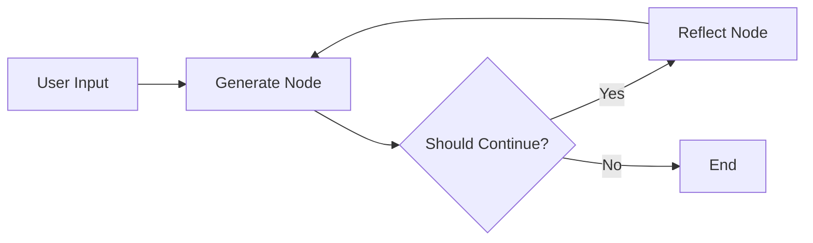

# Twitter Content Generation with Self-Reflection

A LangGraph-based system that generates Twitter content with built-in self-reflection and improvement capabilities.

## Overview

This project demonstrates:
- Automated Twitter content generation
- Self-reflection and content improvement
- Graph-based workflow management
- LangChain integration with GPT-4o

## System Components

### 1. Basic Graph System (`basic.py`)
The main application that orchestrates the content generation and reflection process:

- **Graph Nodes**:
  - `GENERATE`: Creates Twitter content
  - `REFLECT`: Analyzes and critiques generated content

- **Flow Control**:
  - Limits conversations to 6 messages
  - Alternates between generation and reflection
  - Conditional routing based on conversation state

```python
graph = MessageGraph()
graph.add_node(GENERATE, generate_node)
graph.add_node(REFLECT, reflect_node)
```

### 2. Chain Definitions (`chains.py`)
Defines the LLM chains for content generation and reflection:

- **Generation Chain**:
  - Creates Twitter posts
  - Responds to critique
  - Maintains conversation context

- **Reflection Chain**:
  - Evaluates post quality
  - Provides detailed recommendations
  - Focuses on virality and engagement

## Setup

1. Install required dependencies:
```bash
pip install langchain langgraph langchain-openai python-dotenv
```

2. Create a `.env` file:
```env
OPENAI_API_KEY=your_openai_key_here
```

3. Load environment variables:
```python
from dotenv import load_dotenv
load_dotenv()
```

## Usage

Run the system with a topic:

```python
from langchain_core.messages import HumanMessage
response = app.invoke(HumanMessage(content="AI Agents taking over content creation"))
```

## Example Output

```
🔄 Generation Phase:
"🤖 AI agents are revolutionizing content creation! From writing to design, they're becoming the ultimate creative collaborators. But don't worry, they're here to enhance, not replace human creativity. #AI #ContentCreation #FutureOfWork"

📝 Reflection Phase:
"Good start! Consider:
- Add specific statistics
- Include a call to action
- Use more trending hashtags
- Break into multiple lines for readability"

🔄 Improved Generation:
"🚀 Did you know? AI agents now power 40% of content creation!

✍️ From blog posts to social media, AI is revolutionizing how we create.

💡 Try an AI writing assistant today - your productivity will thank you!

#AIrevolution #ContentCreation #ProductivityHacks #DigitalTransformation"
```

## Features

- **Self-Improving**: Content iteratively improves through reflection
- **Context-Aware**: Maintains conversation history
- **Configurable**: Adjustable message limits and routing
- **Visualization**: Supports Mermaid and ASCII graph visualization

## Technical Architecture



## Requirements

- Python 3.8+
- LangChain
- LangGraph
- OpenAI API key

## Limitations

- Requires API credits
- Limited to Twitter-style content
- Maximum 6 message turns
- Dependent on LLM response quality

## Future Improvements

- Multi-platform content adaptation
- Custom reflection criteria
- A/B testing capabilities
- Enhanced performance metrics